# Mermaid

-   [Mermaid docs](https://mermaid-js.github.io/mermaid/)
-   [VSCODE Mermaid Support](https://marketplace.visualstudio.com/items?itemName=bierner.markdown-mermaid) for Markdown Preview

### secuencia

## otro

### gant

## Class diagram

```mermaid
classDiagram
Class01 <|-- AveryLongClass : Cool
Class03 *-- Class04
Class05 o-- Class06
Class07 .. Class08
Class09 --> C2 : Where am i?
Class09 --* C3
Class09 --|> Class07
Class07 : equals()
Class07 : Object[] elementData
Class01 : size()
Class01 : int chimp
Class01 : int gorilla
Class08 <--> C2: Cool label
```

## graph experimental

